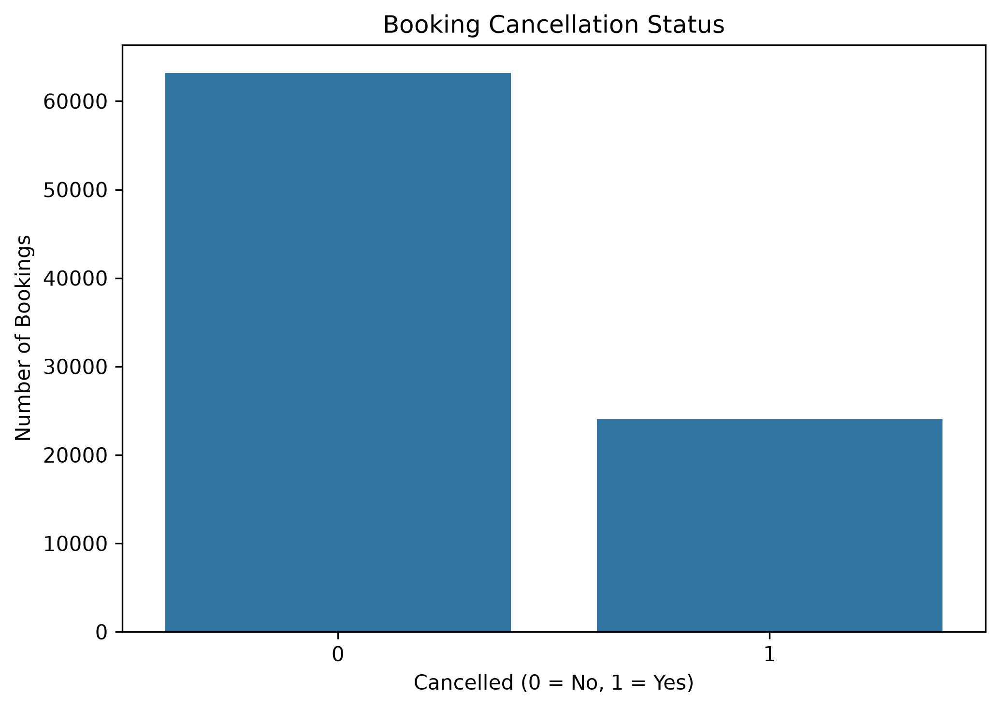
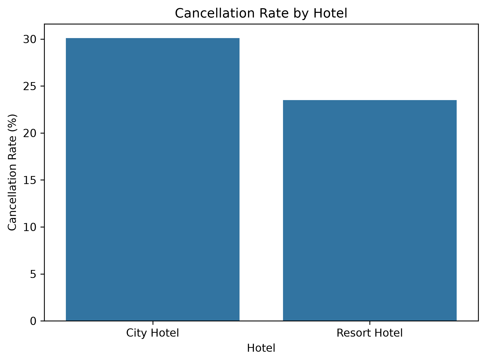
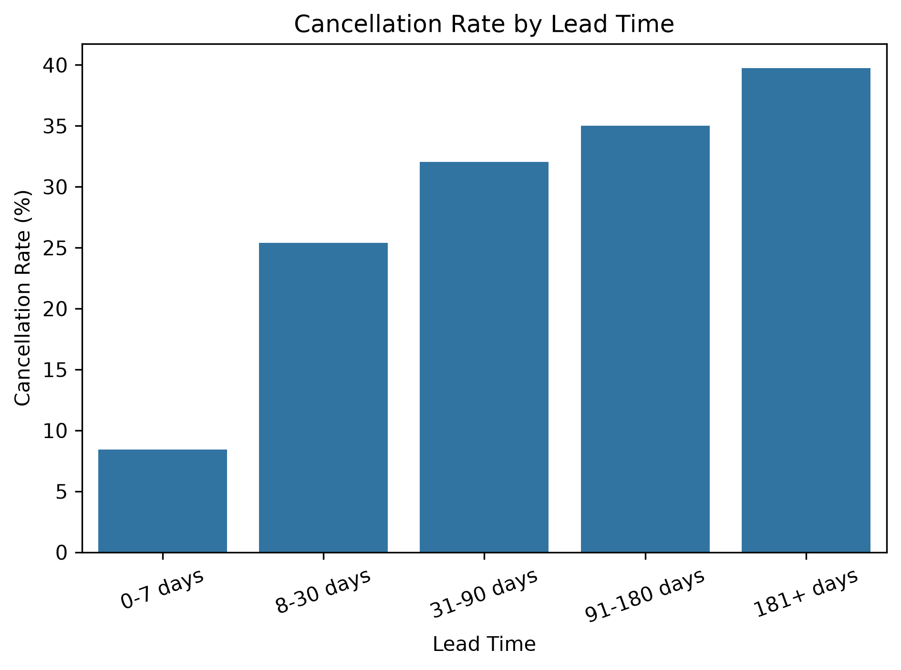
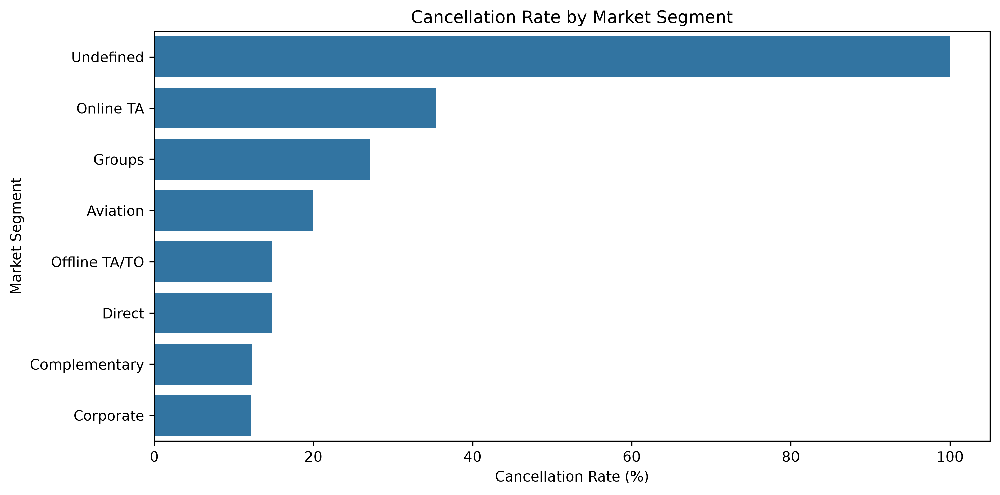
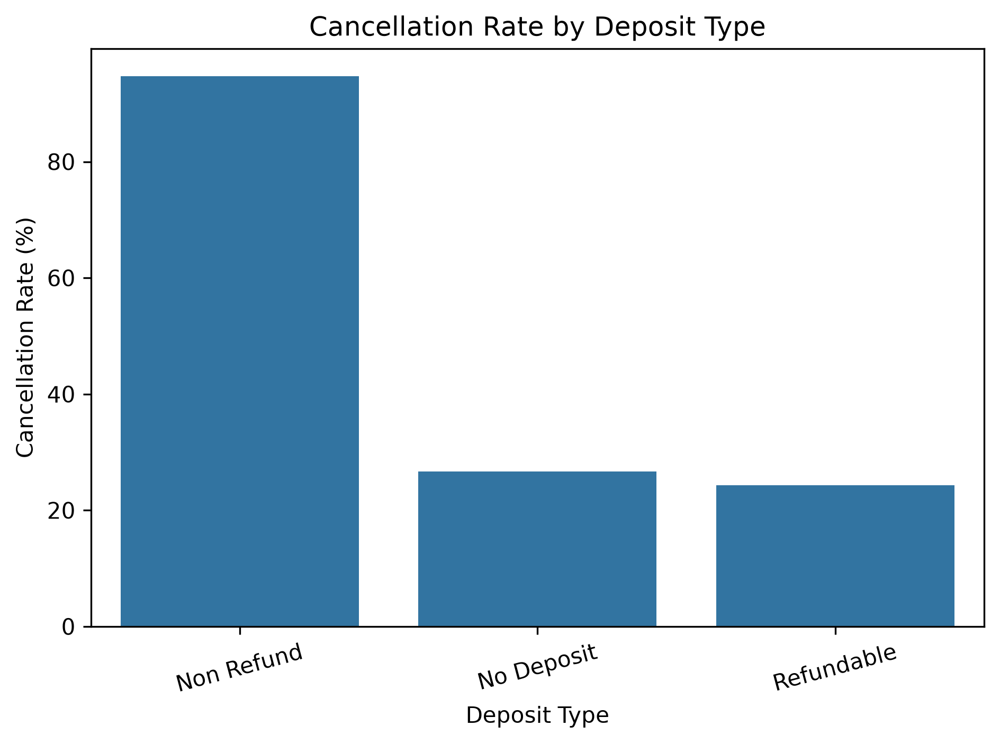
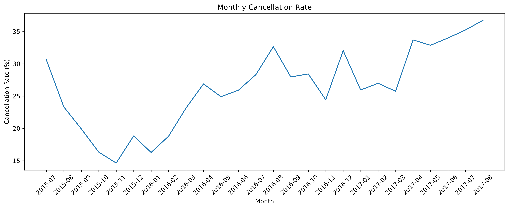

# Hotel Booking Demand & Cancellation Analytics
An exploratory data analysis project focused on understanding **hotel booking behavior and cancellation patterns** using Python.

The project follows an end-to-end analytical workflow from **data cleaning and feature engineering to exploratory analysis, visualization, and business recommendations**.

---

## Project Overview

Hotel cancellations can affect occupancy planning, room availability, and demand forecasting.

This project analyzes hotel booking data to identify patterns associated with cancellations and answer questions such as:

- How frequently are hotel bookings cancelled?
- Do cancellation rates differ between City Hotels and Resort Hotels?
- Are bookings made further in advance more likely to be cancelled?
- Which market segments have higher cancellation rates?
- How does cancellation behavior differ by deposit type?
- How does cancellation behavior change over time?

The analysis is **descriptive and exploratory**. It identifies relationships and patterns in the dataset but does not establish causal relationships.

---

## Business Objective

> **What patterns can be found in hotel bookings and cancellations, and how can these patterns help hotels better understand cancellation risk?**

The goal is to transform booking data into practical insights that can help hotels:

- Monitor higher-risk bookings
- Improve occupancy planning
- Understand booking-channel behavior
- Identify important cancellation patterns
- Support data-driven reservation management

---

## Project at a Glance

| Metric | Result |
|---|---:|
| Cleaned bookings | **87,222** |
| Columns | **34** |
| Overall cancellation rate | **27.53%** |
| City Hotel cancellation rate | **30.10%** |
| Resort Hotel cancellation rate | **23.49%** |
| 0–7 day lead-time cancellation rate | **8.42%** |
| 181+ day lead-time cancellation rate | **39.74%** |
| Online TA cancellation rate | **35.39%** |

---

## Project Workflow

**Raw Data → Data Cleaning → Exploratory Data Analysis → Business Insights**

### 1. Raw Data
Hotel booking records containing information about hotel type, booking dates, guests, market segment, deposit type, ADR, cancellations, and other booking characteristics.

### 2. Data Cleaning
The dataset was inspected, cleaned, validated, and enhanced with additional analytical features.

### 3. Exploratory Data Analysis
Cancellation behavior was analyzed across hotel type, lead time, market segment, deposit type, and time.

### 4. Business Insights
The analysis was translated into practical recommendations around cancellation monitoring and occupancy planning.

---

# Key Findings

## 1. Overall Cancellation Rate



The overall cancellation rate was:

### **27.53%**

Out of **87,222 bookings**:

- **63,213** were not cancelled
- **24,009** were cancelled

Approximately **1 in every 4 bookings** was cancelled.

### Business Insight

Cancellations represent a significant portion of total bookings. Hotels should account for expected cancellations when planning occupancy and future room availability.

---

## 2. Cancellation Rate by Hotel Type



| Hotel Type | Cancellation Rate |
|---|---:|
| City Hotel | **30.10%** |
| Resort Hotel | **23.49%** |

City Hotels had a cancellation rate approximately **6.6 percentage points higher** than Resort Hotels.

### Business Insight

Cancellation behavior differs between the two hotel types.

This is an observed relationship in the dataset and does **not** mean that hotel type causes cancellations.

### Recommendation

Hotels could monitor City Hotel cancellations separately and investigate whether particular customer groups, channels, or booking characteristics contribute to the difference.

---

## Cancellation Rate by Lead Time



| Lead Time | Cancellation Rate |
|---|---:|
| 0–7 days | **8.42%** |
| 8–30 days | **25.39%** |
| 31–90 days | **32.04%** |
| 91–180 days | **35.01%** |
| 181+ days | **39.74%** |

A clear pattern appears in the dataset: **cancellation rates increase as lead time increases**.

Bookings made more than 181 days in advance had the highest cancellation rate at **39.74%**, while bookings made within 7 days had the lowest at **8.42%**.

### Business Insight

Longer lead-time bookings are associated with higher cancellation rates.

### Recommendation

Hotels could:

- Monitor long lead-time reservations more closely
- Send confirmation reminders before arrival
- Consider expected cancellations during occupancy forecasting
- Monitor future room availability carefully

---

## 4. Cancellation Rate by Market Segment



Online Travel Agency (**Online TA**) was the largest market segment, with:

- **51,550 bookings**
- **35.39% cancellation rate**

### Cancellation Rates

| Market Segment | Cancellation Rate |
|---|---:|
| Online TA | **35.39%** |
| Groups | 27.07% |
| Aviation | 19.91% |
| Offline TA/TO | 14.85% |
| Direct | 14.75% |
| Complementary | 12.28% |
| Corporate | 12.13% |

The `Undefined` segment showed a 100% cancellation rate, but it contained only **2 bookings**, so it was not treated as a meaningful pattern.

### Business Insight

Online TA is particularly important because it combines:

- High booking volume
- Relatively high cancellation rate

### Recommendation

Hotels could:

- Monitor OTA cancellation rates regularly
- Compare OTA performance with direct bookings
- Track changes in OTA cancellation behavior
- Include expected OTA cancellations in occupancy planning

---

## 5. Cancellation Rate by Deposit Type



| Deposit Type | Cancellation Rate |
|---|---:|
| Non Refund | **94.70%** |
| No Deposit | 26.72% |
| Refundable | 24.30% |

The `Non Refund` category produced an unusually high cancellation rate of **94.70%**.

### Important Analytical Note

This result should **not immediately be treated as a final business conclusion**.

The unusually high rate should be investigated further to understand:

- Whether the data was recorded correctly
- Which market segments are associated with this category
- Which booking channels are involved
- Whether the pattern is concentrated in a particular period
- Whether there are data-definition or data-quality issues

### Recommendation

Validate this result before using it to change cancellation or deposit policies.

---

## 6. Cancellation Trends Over Time



Cancellation rates varied across different months.

Examples include:

| Month | Cancellation Rate |
|---|---:|
| November 2015 | 14.64% |
| January 2016 | 16.28% |
| June 2017 | 34.00% |
| July 2017 | 35.24% |
| August 2017 | 36.74% |

Higher cancellation rates were observed during several months in 2017 compared with some earlier periods.

### Business Insight

Cancellation behavior changes over time, suggesting that time-related or seasonal patterns may be relevant when monitoring cancellation risk.

### Recommendation

Hotels could track historical monthly cancellation patterns when planning future occupancy and reservation capacity.

---

# Business Insights & Recommendations

| Finding | Business Implication | Recommended Action |
|---|---|---|
| Overall cancellation rate is 27.53% | A significant portion of bookings may not result in stays | Include expected cancellations in occupancy planning |
| City Hotels have higher cancellations | Cancellation behavior differs by hotel type | Monitor City Hotel bookings separately |
| Long lead times have higher cancellation rates | Advance bookings appear more cancellation-prone | Use reminders and closer monitoring |
| Online TA has high volume and cancellation rate | OTA bookings represent an important cancellation-risk segment | Monitor OTA cancellation behavior |
| Non Refund shows an unusually high cancellation rate | Result may require validation | Investigate before making policy decisions |
| Cancellation rates vary over time | Cancellation risk may change across periods | Include historical trends in planning |

---

# Data Cleaning & Feature Engineering

The data preparation process was performed in:

[`notebooks/01_data_cleaning.ipynb`](notebooks/01_data_cleaning.ipynb)

### Data Cleaning

The following steps were performed:

- Converted `reservation_status_date` to datetime
- Filled missing `children` values with `0`
- Filled missing `country` values with `"Unknown"`
- Filled missing `agent` values with `0`
- Removed the `company` column because approximately 94% of its values were missing
- Identified and removed duplicate rows
- Checked guest, stay, lead-time, and ADR values for invalid negatives
- Removed one booking with a negative ADR
- Investigated bookings with zero recorded guests
- Removed zero-guest bookings from the final analytical dataset
- Validated the cleaned dataset before saving it

### Feature Engineering

The following features were created:

```python
total_guests = adults + children + babies

total_stay_nights = (
    stays_in_weekend_nights +
    stays_in_week_nights
)

total_previous_bookings = (
    previous_cancellations +
    previous_bookings_not_canceled
)
```

Lead time was grouped into:

- 0–7 days
- 8–30 days
- 31–90 days
- 91–180 days
- 181+ days

An `arrival_date` variable was also created from the arrival year, month, and day.

The cleaned dataset was saved as:

```text
data/processed/hotel_bookings_clean.csv
```

---

# Exploratory Data Analysis

EDA was performed in:

[`notebooks/02_eda.ipynb`](notebooks/02_eda.ipynb)

The analysis focused on:

1. Overall cancellation rate
2. Cancellation by hotel type
3. Cancellation by market segment
4. Cancellation by lead time
5. Cancellation by deposit type
6. Cancellation trends over time

The visualizations generated by the EDA notebook are stored in the `image/` directory.

---

# Analytical Limitations

This project is an exploratory and descriptive analysis.

The findings represent **relationships and patterns in the dataset**, not causal relationships.

For example:

> Longer lead times are associated with higher cancellation rates.

This does **not** mean:

> Longer lead times cause cancellations.

Further statistical analysis or predictive modeling would be required to investigate causality or build a cancellation-risk prediction system.

The unusually high `Non Refund` cancellation rate also requires additional validation before being used as a definitive business conclusion.

---

# Project Structure

```text
hotel-booking-analytics/
│
├── image/
│   ├── booking_cancellation_status.png
│   ├── cancellation_by_deposit_type.png
│   ├── cancellation_by_hotel.png
│   ├── cancellation_by_lead_time.png
│   ├── cancellation_by_market_segment.png
│   ├── cancellation_rate_overtime.png
│   └── project_workflow.png
│
├── notebooks/
│   ├── 01_data_cleaning.ipynb
│   └── 02_eda.ipynb
│
├── .gitignore
├── README.md
└── requirements.txt
```

> The dataset files are kept outside the tracked repository structure and are expected under the local `data/processed/` directory when running the notebooks.

---

# Technologies & Tools

- **Python**
- **Pandas**
- **NumPy**
- **Matplotlib**
- **Seaborn**
- **Jupyter Notebook**
- **Git**
- **GitHub**

---

# How to Run the Project

## 1. Clone the repository

```bash
git clone https://github.com/aryasomvanshi08/hotel-booking-analytics.git
cd hotel-booking-analytics
```

## 2. Create a virtual environment

### Windows

```bash
python -m venv venv
venv\Scripts\activate
```

### macOS / Linux

```bash
python3 -m venv venv
source venv/bin/activate
```

## 3. Install dependencies

```bash
pip install -r requirements.txt
```

## 4. Prepare the dataset

Download the **Hotel Bookings** dataset from Kaggle and place the required data file in:

```text
data/processed/hotel_bookings.csv
```

## 5. Run the notebooks

Start Jupyter:

```bash
jupyter notebook
```

Then run the notebooks in order:

```text
01_data_cleaning.ipynb
        ↓
02_eda.ipynb
```

The cleaning notebook creates:

```text
data/processed/hotel_bookings_clean.csv
```

which is then used by the EDA notebook.

---

# Notebooks

### 01 — Data Cleaning & Feature Engineering

[`01_data_cleaning.ipynb`](notebooks/01_data_cleaning.ipynb)

Covers:

- Dataset inspection
- Missing-value handling
- Duplicate detection and removal
- Invalid-value checks
- Data validation
- Feature engineering
- Saving the cleaned dataset

### 02 — Exploratory Data Analysis

[`02_eda.ipynb`](notebooks/02_eda.ipynb)

Covers:

- Overall cancellation rate
- Hotel-type comparison
- Market-segment analysis
- Lead-time analysis
- Deposit-type analysis
- Monthly cancellation trends
- Data visualizations

---

# Visualizations

The project includes visualizations for:

- Overall booking cancellation status
- Cancellation rate by hotel type
- Cancellation rate by lead time
- Cancellation rate by market segment
- Cancellation rate by deposit type
- Monthly cancellation rate

All visualizations are available in the [`image/`](image/) directory.

---

# Skills Demonstrated

This project demonstrates practical experience with:

- Data Cleaning
- Data Validation
- Missing Value Handling
- Duplicate Detection
- Feature Engineering
- Exploratory Data Analysis
- Data Visualization
- Grouped Statistical Analysis
- Pattern Identification
- Business Insight Generation
- Business Recommendations
- Python Data Analysis
- Jupyter Notebook
- Git & GitHub

---

# About Me

## Arya Singh

**Aspiring Data Analyst**

I am building practical data analytics projects focused on transforming raw datasets into meaningful insights and business recommendations.

### Technical Skills

**Python | Pandas | NumPy | Matplotlib | Seaborn | Jupyter Notebook | Git | GitHub**

---

# Connect With Me

- **GitHub:** [github.com/aryasomvanshi08](https://github.com/aryasomvanshi08)
- **LinkedIn:** [linkedin.com/in/aryasomvanshi08](https://www.linkedin.com/in/aryasomvanshi08)
- **Email:** aryasomvanshi08@gmail.com

---

## Project Summary

This project demonstrates an end-to-end exploratory analytics workflow:

**Raw Hotel Booking Data → Data Cleaning & Validation → Feature Engineering → Exploratory Data Analysis → Visualization → Business Insights → Actionable Recommendations**

The analysis highlights how booking characteristics such as **hotel type, lead time, market segment, deposit type, and arrival period** are associated with different cancellation patterns.
